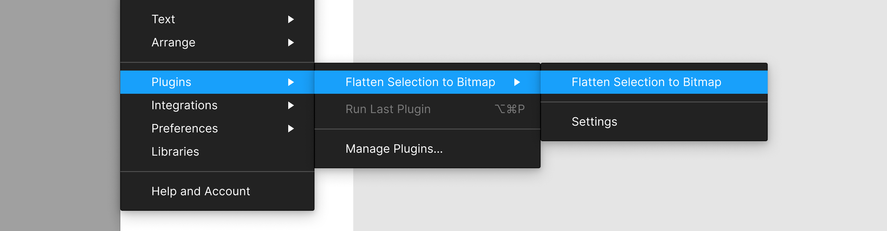

# Specifying multiple commands in the plugin sub-menu

Commands can be specified on the **`"menu"`** key under **`"figma-plugin"`**:

```json
{
  "figma-plugin": {
    "id": "837846252158418235",
    "name": "Flatten Selection to Bitmap",
    "menu": [
      {
        "name": "Flatten Selection to Bitmap",
        "main": "src/flatten-selection-to-bitmap/main.js"
      },
      "-",
      {
        "name": "Settings",
        "main": "src/settings/main.js",
        "ui": "src/settings/ui.js"
      }
    ]
  }
}
```

See that:

- The name of the plugin (to be shown at the “top-level”) is **`"Flatten Selection to Bitmap"`**.
- **`"Flatten Selection to Bitmap"`** and **`"Settings"`** are the two commands in the plugin sub-menu. Of these two commands, only the **`"Settings"`** command has a UI implementation.
- A **`"-"`** is used to specify a separator between the two commands in the plugin sub-menu.

The above configuration would result in the following:


